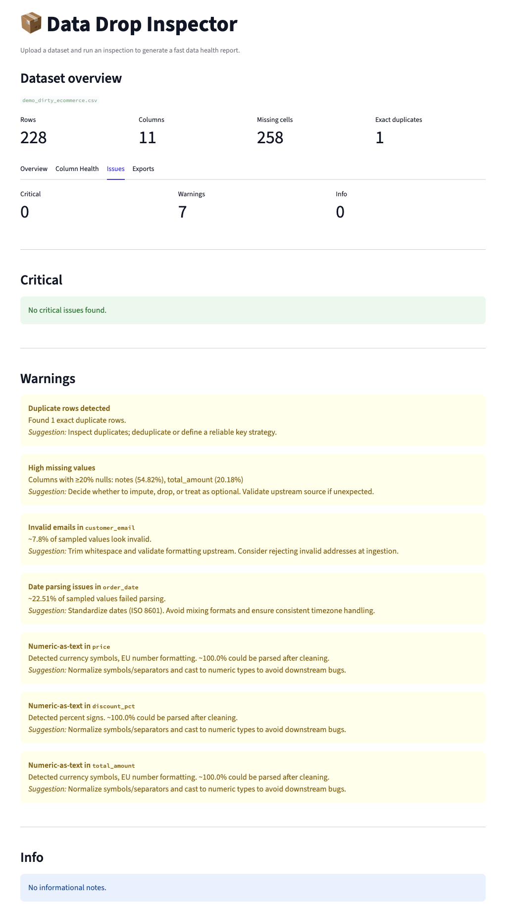
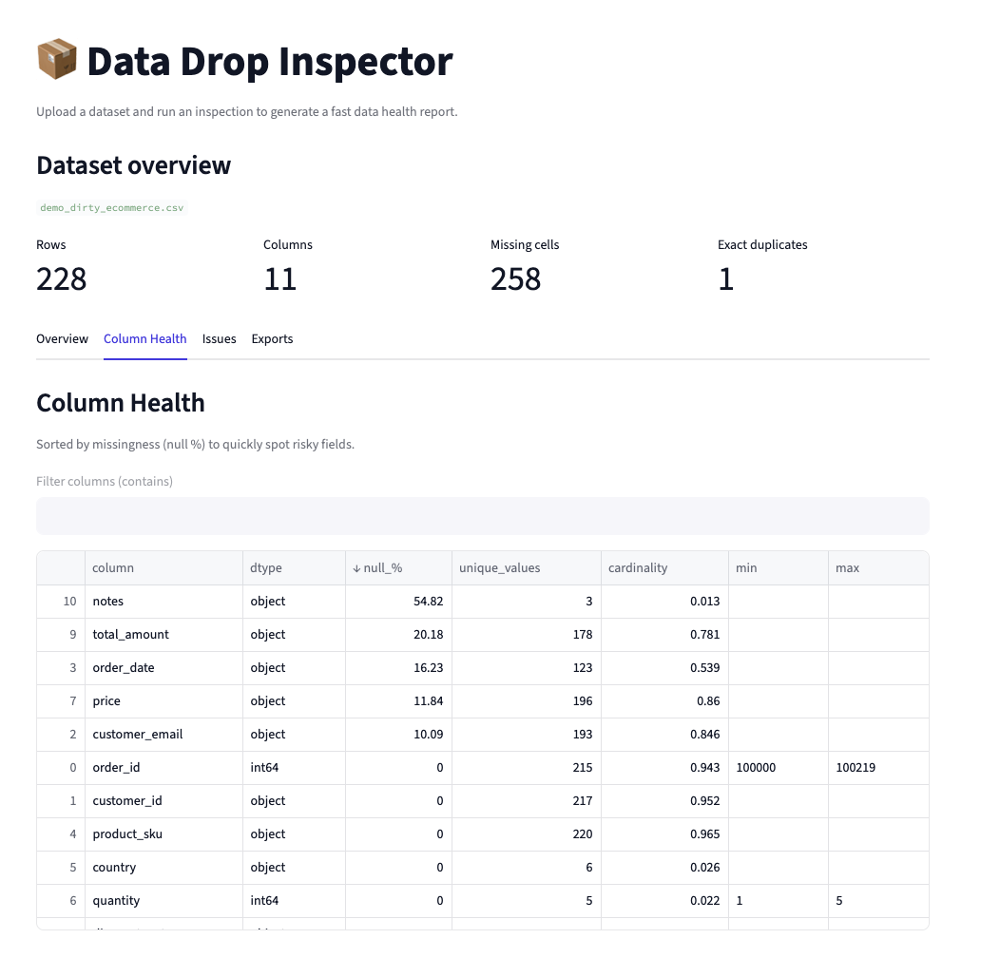

# Data Drop Inspector

A lightweight **data health inspection tool** designed for freelance analytics workflows and internal data teams.

Upload a CSV or XLSX file, run a single inspection, and instantly surface common data quality issues such as missing values, duplicates, mixed types, invalid emails, date parsing problems, and numeric fields stored as text. Export both a structured JSON report and a safely cleaned dataset.

---

## What problem does this solve?

When starting a new data project, a large portion of time is often spent on:
- Understanding data shape and quality
- Identifying silent issues before modeling or reporting
- Doing repetitive first-pass cleaning and QA

**Data Drop Inspector** compresses this initial phase into a fast, repeatable workflow.

---

## Features

### Dataset overview
- Row and column counts
- Total missing cells
- Exact duplicate rows

### Column health profiling
- Data type
- Missing value percentage
- Unique value count and cardinality
- Min / max values where applicable
- Sorted by missingness to highlight risky fields

### Automated issue detection
- Duplicate rows
- High-missingness columns
- Mixed-type columns
- Invalid email formats (heuristic column detection)
- Date parsing issues (mixed or inconsistent formats)
- Numeric fields stored as text (currency symbols, percent signs, EU number formats)

Each issue includes a **clear explanation** and a **practical suggestion**.

### Exports
- **JSON inspection report** (machine-readable)
- **Safely cleaned CSV**
  - Trimmed strings
  - Normalized empty values
  - Optional duplicate removal

---

## Screenshots

### Issues overview
Common data quality problems surfaced automatically with clear recommendations.



### Column health profiling
Column-level statistics sorted by missingness to quickly identify problematic fields.



---

## Try it with the demo dataset

This repository includes intentionally messy demo files to showcase all checks:

- `sample_data/demo_dirty_ecommerce.csv`
- `sample_data/demo_dirty_ecommerce.xlsx`

Upload one of them and click **Run inspection**.

---

## Quick start

```bash
python -m venv .venv
source .venv/bin/activate
pip install -r requirements.txt
streamlit run app.py